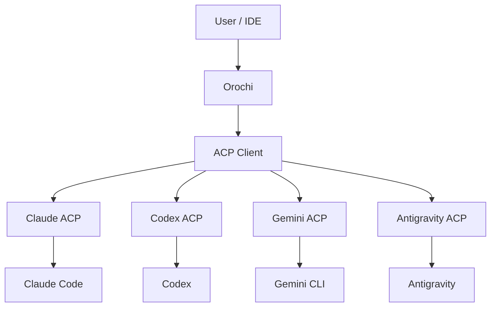
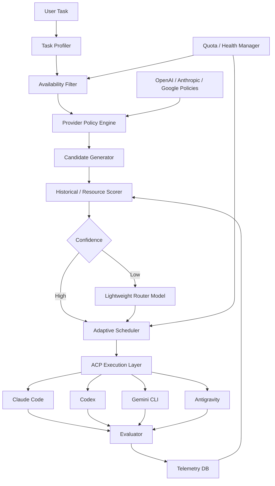
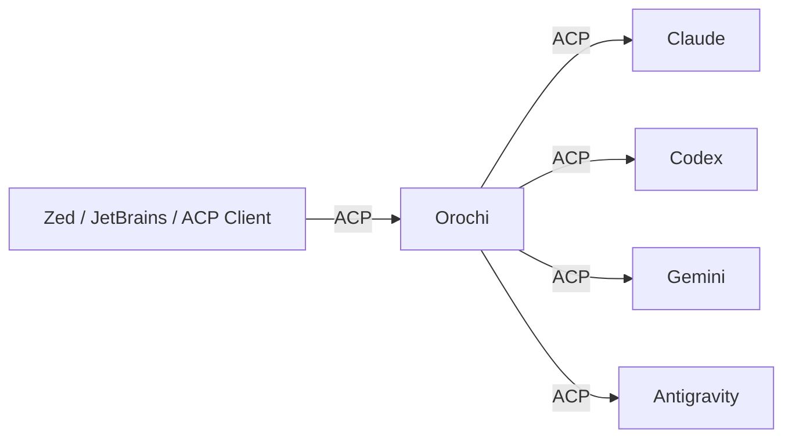

# Orochi — Adaptive Agent & Model Scheduler

**Status:** Draft  
**Project Name:** Orochi  
**Target:** Local CLI / OSS  
**Language:** Rust  
**Protocol:** Agent Client Protocol (ACP)  
**Primary use case:** 複数のAI Coding Agentとモデルを、利用可能性・性能・トークン効率・Provider公式推奨に基づいて自動選択する

---

## 1. Overview

**Orochi** は、Claude Code、Codex、Gemini CLI、Antigravity等の複数Coding Agentを単一CLIから利用し、タスクごとに最適な

**Agent × Model × Reasoning Level × Session Strategy**

を自動選択するローカル実行基盤である。

ユーザーは原則としてAgentやModelを指定しない。

```bash id="txqo5n"
orochi "認証処理をrefresh token方式に変更して"
```

のみを実行する。

Orochiは内部で現在の利用制限、タスク難易度、モデル特性、Provider公式Best Practice、過去の実行成績、Context/Cache状態を考慮し、最も効率的な実行構成を選択する。

本プロジェクトの目的は単純な「最安モデル選択」ではない。

> **成功するまでに必要となる期待総リソース消費量を最小化する。**

これを最適化対象とする。

---

# 2. Goals

| Goal | 内容 |
|---|---|
| Agent自動選択 | Claude / Codex / Gemini / Antigravity等から選択 |
| Model自動選択 | Sonnet / Fable / Astra / Flash等をタスクに応じて選択 |
| Reasoning自動選択 | low / medium / high等を自動設定 |
| Quota-aware | 利用制限中のAgentを自動的に除外 |
| Token-aware | token消費、cache、retryを考慮 |
| Provider-aware | OpenAI / Anthropic / Google公式推奨に従う |
| Adaptive | 実際の成功率・消費量から徐々に最適化 |
| ACP-native | Agent固有実装を最小限にする |
| Local-first | 原則としてユーザーPC上で実行 |
| Zero-decision UX | 通常利用時はモデル選択をユーザーに要求しない |

---

# 3. Non-Goals

MVPでは独自Coding Agent自体は実装しない。

Claude CodeやCodex等の既存Agentを置き換えるのではなく、

```text id="ooiuhx"
User
 ↓
Orochi
 ↓
Existing Coding Agents
```

というControl Planeとして動作する。

また、MVPでは複数AgentによるCouncil/多数決をデフォルト動作にしない。複数Agent実行はtoken効率を大幅に悪化させるため、単一Agentでの成功可能性が十分高い限り利用しない。

---

# 4. Technical Decision

## 4.1 Rust

Orochi本体はRustで実装する。

今回のシステムはLLMアプリケーションというより、

**Process Supervisor + Scheduler + Protocol Gateway**

という性質が強い。

長時間動作する複数subprocess、stdio、JSON-RPC、timer、SQLite、signal処理、並列sessionを安全に扱う必要があるためRustとの相性が良い。

ACPには公式Rust SDKがあり、Client / Agent / Proxy / Conductorが提供されている。 ([github.com](https://github.com/agentclientprotocol/rust-sdk?utm_source=chatgpt.com))

主要技術は以下を想定する。

| Purpose | Technology |
|---|---|
| Runtime | Tokio |
| CLI | clap |
| Serialization | serde |
| ACP | agent-client-protocol |
| Database | SQLite |
| DB access | sqlx / rusqlite |
| Logging | tracing |
| Error | thiserror |

---

# 5. ACP Strategy

ACPを**Agent Execution Abstraction**として利用する。

ACP自体にrouting logicを持たせない。



ACP v1は現在stableである。Session Config Optionsもstable化されており、Agentは`model`、`mode`、`thought_level`などのsession-level configurationを公開できる。したがってモデル名やreasoning levelをOrochi側に完全ハードコードする必要はない。 ([agentclientprotocol.com](https://agentclientprotocol.com/announcements/session-config-options-stabilized?utm_source=chatgpt.com))

AntigravityについてもACP ecosystem上から利用可能なintegrationが存在するため、同一Control Planeへ統合対象とする。 ([zed.dev](https://zed.dev/acp/agent/antigravity-acp?utm_source=chatgpt.com))

---

# 6. ACPでは解決しない領域

ACPだけではOrochiは完成しない。

特に現在のACP stable仕様では、以下が十分標準化されていない。

| Capability | ACP |
|---|---|
| Model discovery | Stable |
| Reasoning configuration | Stable |
| Session management | Stable |
| Agent execution | Stable |
| Token usage | Draft |
| Context consumption | Draft |
| API cost | Draft |
| Subscription quota | 非標準 |
| Rate-limit reset | 非標準 |
| Weekly / 5h usage limit | 非標準 |

ACPのSession Usage proposalはtoken usage、cached tokens、thought tokens、context usage等を標準化する方向だが、現時点ではDraftである。 ([agentclientprotocol.com](https://agentclientprotocol.com/rfds/session-usage?utm_source=chatgpt.com))

したがって以下の構造を採用する。

```text id="oww8v5"
Agent Integration

ACP Standard Layer
        +
Provider Adapter
        +
Runtime Observation
```

---

# 7. High-Level Architecture



---

# 8. Execution Unit

OrochiはAgentとModelを別々に選択するのではなく、最終的には以下を一つのCandidateとして扱う。

```text id="q8okk8"
ExecutionCandidate

agent
model
reasoning_level
mode
session_strategy
context_strategy
```

例えば、

```text id="6e0gm1"
Codex + GPT-5.6 Sol + medium
Codex + GPT-6 Astra + high

Claude + Sonnet + medium
Claude + Fable + high

Gemini + Flash + low
Gemini + Pro + high
```

が別Candidateになる。

これにより、

> 「ClaudeかCodexか」

ではなく、

> 「このタスクを成功させる期待コストが最も低いexecution configurationは何か」

を直接最適化できる。

---

# 9. Control Plane

## 9.1 Task Profiler

最初からLLMへタスク全文とrepositoryを渡さない。

可能な限りローカル情報からTask Descriptorを生成する。

```text id="fcc344"
TaskDescriptor

task_type
language
framework
repo_size
candidate_files
estimated_scope
estimated_context
requires_architecture_change
requires_browser
requires_web
tests_available
ambiguity
long_horizon
```

Task type例：

```text id="r4tuv1"
bug_fix
small_edit
implementation
refactor
architecture
migration
test
review
documentation
investigation
```

repositoryのgit diff、file tree、manifest、test環境等から自動推定する。

---

# 10. Three-Level Routing

Routing自体によるtoken消費を最小化する。

## Level 0 — Deterministic Router

LLMを使用しない。

```text id="3hllib"
Task
 ↓
Capability
Quota
Provider Policy
Historical Statistics
 ↓
confidence >= threshold
 ↓
Execute
```

十分なconfidenceがある場合は即座に実行する。

---

## Level 1 — Lightweight Router Model

判断が曖昧な場合のみ小型モデルを使用する。

Router Model poolは例えば、

```text id="srho6f"
Gemini Flash
GPT Luna
Claude Haiku
```

等の低コスト / 高速モデルから構成する。

Routerへの入力はTask Descriptorと候補一覧だけに制限する。

repository全文は渡さない。

Routerは選択肢を推薦するだけであり、**最終決定権を持たない**。

---

## Level 2 — Frontier Judge

極めて難しい判断のみ使用する。

例：

```text id="ghqwzw"
大規模architecture migration
未知のrepository
非常に高いambiguity
複数frontier modelの期待性能が拮抗
```

この場合のみAstra / Fable等へplanning / routing判断を問い合わせる。

通常は使用しない。

---

# 11. Provider Policy Engine

Orochi独自の感覚ではなく、各Provider公式推奨をfirst-class policyとして扱う。

優先順位は以下とする。

1. Provider hard constraints
2. Provider official recommendations
3. ACP runtime capabilities
4. Current quota / health
5. Historical local performance
6. Router recommendation

### OpenAI

OpenAIはモデルごとのreasoning effortを明示的に調整することを推奨しており、最新model guidanceでも高いeffortを常に使用するのではなく、evalで改善が確認できる場合にのみ上げる方針を示している。 ([developers.openai.com](https://developers.openai.com/api/docs/guides/latest-model?utm_source=chatgpt.com))

したがってOpenAI Policyは、

```text id="x56470"
simple
→ low

normal agentic coding
→ medium

complex
→ high

extremely difficult / long-horizon
→ xhigh等
```

を初期priorとする。

Astra等のfrontier modelも「高価だから最後」という扱いにはしない。

高性能モデルを最初から使用した方がretryを減らせる場合は、その方が期待token消費量が少なくなるためである。

---

### Anthropic

Claude最新世代ではadaptive thinkingが推奨されている。

Anthropicはadaptive thinkingについて、query complexityと`effort`からClaude自身がthinking量を動的調整する方式を推奨し、complex codingやlong-horizon agent loopsに適するとしている。 ([docs.anthropic.com](https://docs.anthropic.com/en/docs/build-with-claude/prompt-engineering/prompt-templates-and-variables?utm_source=chatgpt.com))

したがってAnthropic Policyでは、固定thinking budgetをOrochiが細かく指定するより、

```text id="b1wf1h"
model selection
+
effort selection
+
adaptive thinking
```

を基本とする。

---

### Google

Geminiはデフォルトでtask complexityに応じたdynamic thinkingを行い、`thinking_level`で制御できる。 ([ai.google.dev](https://ai.google.dev/gemini-api/docs/thinking?hl=ja&utm_source=chatgpt.com))

したがって、

```text id="ntunv6"
simple → minimal / low
normal → medium
complex → high
```

をinitial priorとする。

---

# 12. Policy Distribution

Provider PolicyはRust binaryへ完全ハードコードしない。

```text id="xkugvn"
policies/

openai.json
anthropic.json
google.json
```

としてversion管理する。

Policyは少なくとも以下を持つ。

| Field | Description |
|---|---|
| provider | Provider |
| version | Policy version |
| source | 公式document |
| updated_at | 更新日時 |
| models | モデル情報 |
| task_profiles | 推奨用途 |
| reasoning_rules | reasoning設定 |
| context_rules | context戦略 |
| cache_rules | cache戦略 |
| hard_constraints | 禁止設定 |
| fallback_rules | fallback方針 |

CLIからPolicy更新を可能にする。

```bash id="wdbi46"
orochi policy update
```

Provider documentation更新に追従できる構造にする。

---

# 13. Quota Manager

Agent単位・Model単位でruntime stateを保持する。

```text id="emz2jr"
AVAILABLE
  ↓
SOFT_LIMIT
  ↓
COOLDOWN
  ↓
PROBE
  ↓
AVAILABLE
```

内部状態：

```text id="7wmnrl"
AgentRuntimeState

agent
model
status

quota_estimate
cooldown_until

last_success_at
last_failure_at

consecutive_failures
rate_limit_count
```

rate-limit responseからreset時刻が取得できれば、

```text id="c9hr9w"
cooldown_until = reset_at
```

とする。

取得できない場合はexponential backoffを利用する。

```text id="2o8lus"
5m
15m
30m
60m
```

COOLDOWN中のAgentはCandidate Generatorから完全に除外する。

---

# 14. Quota Shadow Price

Subscription利用時はAPI価格だけでは最適化できない。

残り利用枠そのものを仮想的なコストとして扱う。

```text id="nr0j0j"
effective_resource_cost
=
expected_tokens
× quota_shadow_price
```

例えば、

```text id="b6fev8"
Claude
estimated remaining = 8%
reset = 4h

Codex
estimated remaining = 75%
reset = 1h
```

なら、性能差が小さいタスクではCodexを優先する。

一方でClaude / Fableでなければ成功率が大きく低下するタスクならClaudeを選択可能とする。

---

# 15. Optimization Objective

最適化対象はtoken単価ではない。

```text id="alpro0"
Expected Resource Cost To Successful Completion
```

とする。

概念的には、

```text id="ktlca4"
expected_cost =

expected_input_tokens
+ expected_output_tokens
+ expected_reasoning_tokens
+ retry_cost
+ cache_miss_cost
+ context_rehydration_cost
+ quota_shadow_cost
+ latency_penalty
```

を最小化する。

制約条件：

```text id="wy8zb8"
P(success) >= required_confidence
```

これにより、

```text id="6lsete"
cheap model
→ failure
→ medium
→ failure
→ frontier
```

というtoken浪費を避け、

必要なタスクでは最初からFable / Astra等を利用する。

---

# 16. Cache-Aware Scheduling

ProviderごとのPrompt / Context Cacheを利用する。

Google Geminiではimplicit context cachingがデフォルトで有効であり、共通する大きなcontentをprefix側へ置くことでcache hit probabilityを上げられる。 ([ai.google.dev](https://ai.google.dev/gemini-api/docs/caching?authuser=01&hl=en&utm_source=chatgpt.com))

OpenAIもprompt cache keyおよびcache breakpointを提供している。 ([developers.openai.com](https://developers.openai.com/api/reference/cli/resources/responses/methods/create?utm_source=chatgpt.com))

したがってSchedulerは、

```text id="4waio4"
same repository
same instructions
same tool set
same model
```

を持つtaskについてcache affinityをscoreへ加える。

必要以上にProvider / Modelを切り替えない。

---

# 17. Context Management

Agent間でconversation history全体を受け渡さない。

Orochiが独立した`TaskEnvelope`を保持する。

```text id="n3f6g5"
TaskEnvelope

original_task
constraints

current_status

changed_files
git_diff_summary

tests
failed_tests

completed_items
remaining_items
```

repository自体はfilesystemをsingle source of truthとする。

例えばCodexが利用制限に到達した場合、

```text id="ynikhy"
Codex
 ↓
COOLDOWN
 ↓
TaskEnvelope生成
 ↓
Claudeへhandoff
 ↓
Claudeがfilesystem / gitから再認識
```

とする。

これによりAgent変更時のtoken消費を抑える。

---

# 18. Evaluator

Orochiの学習には実行結果の評価が必要になる。

LLM Judgeを最初から使用しない。

優先順位：

```text id="7y14sl"
tests
typecheck
lint
build
runtime checks
git diff validation
```

これらで評価できない場合のみLLM Judgeを利用する。

結果は、

```text id="hf11qp"
success
partial_success
failure
```

に分類する。

---

# 19. Telemetry

SQLiteへ各runを記録する。

主要項目：

| Category | Fields |
|---|---|
| Task | type, language, framework, scope |
| Environment | repository, files, context size |
| Execution | agent, model, reasoning |
| Usage | input/output/reasoning/cache tokens |
| Runtime | duration, retries |
| Quality | tests/build/lint |
| Outcome | success/partial/failure |
| User signal | retry/revert/follow-up |

個人情報やsource codeそのものはTelemetry DBへ保存しない。

---

# 20. Adaptive Learning

初期段階ではProvider Policyとheuristicを利用する。

```text id="xgu7r3"
Phase 1
Official Policy + Rules

↓

Phase 2
Official Policy + EWMA statistics

↓

Phase 3
Contextual Bandit
```

最終的にはContextual Thompson Sampling等を検討する。

Context：

```text id="jjnior"
task_type
language
framework
scope
context_size
ambiguity
tests_available
quota_state
cache_affinity
```

Arm：

```text id="aqzd0y"
Agent + Model + Reasoning
```

Reward：

```text id="vv61pb"
successful completion
────────────────────────
effective resource usage
```

とする。

ただしProvider hard constraintは学習によって上書きしない。

---

# 21. Official Policy vs Learning

Policyと実測値が競合した場合、以下の階層を維持する。

```text id="gckmb2"
Provider Hard Constraint
        ↓
Official Recommendation
        ↓
Empirical Optimization
```

初期状態ではOfficial Policyを強くpriorとして利用し、観測データが増えるにつれてlocal telemetryのweightを増加させる。

ただし例えばProviderが特定parameterを使用しないことを明示している場合、そのparameterは探索対象にしない。

---

# 22. Agent Adapter

Provider固有処理をOrochi本体へ入れない。

```text id="mtsm5w"
AgentAdapter

discover_capabilities()
discover_models()
set_model()
set_reasoning()

get_usage()
get_quota()

classify_error()

spawn()
stop()

create_session()
resume_session()
```

共通部分はACPへdelegateする。

```text id="865xnj"
ACP
 ├─ session
 ├─ prompt
 ├─ model
 ├─ thought_level
 └─ streaming
```

不足部分のみAdapterが実装する。

```text id="f3mc8x"
ClaudeAdapter
CodexAdapter
GeminiAdapter
AntigravityAdapter
```

ACPのSession Usageが将来stable化した場合はProvider固有コードを段階的に削除可能にする。 ([agentclientprotocol.com](https://agentclientprotocol.com/rfds/session-usage?utm_source=chatgpt.com))

---

# 23. Orochi as an ACP Agent

将来的にはOrochi自身もACP Agentとして公開する。



外部Clientから見ると、

```text id="ouekqj"
Orochi
```

という1つのAgentだけが存在する。

内部のAgent / Model選択は完全に隠蔽する。

公式Rust ACP SDKはClient / AgentだけでなくProxy / Conductorも提供しており、このようなcompositionを実装しやすい。 ([github.com](https://github.com/agentclientprotocol/rust-sdk?utm_source=chatgpt.com))

これによりOrochiはCLIとしてだけでなく、

**ACP-compatible Smart Agent Gateway**

としても利用可能になる。

---

# 24. CLI UX

通常利用：

```bash id="4t0vuc"
orochi "このIssueを実装して"
```

状態確認：

```bash id="8d57mp"
orochi status
```

想定表示：

```text id="pytzie"
AGENT          MODEL             STATUS       QUOTA
Codex          GPT-5.6 Sol       available    healthy
Claude         Sonnet            cooldown     41m
Antigravity    Gemini Flash      available    healthy
Gemini CLI     Gemini Flash      available    healthy

Current route:
Codex / GPT-5.6 Sol / medium

Reason:
- medium complexity implementation
- strong historical success rate
- healthy quota
- reusable context/cache
```

明示指定もescape hatchとして残す。

```bash id="ud0syq"
orochi --agent claude "..."
orochi --model fable "..."
orochi --reasoning high "..."
```

ただし通常利用では不要とする。

Policy操作：

```bash id="z19q1d"
orochi policy status
orochi policy update
```

Agent確認：

```bash id="ji628k"
orochi agents
```

Session確認：

```bash id="diq3yk"
orochi sessions
```

---

# 25. Suggested Project Structure

```text id="mkeb6h"
orochi/

src/

main.rs

cli/
    run
    status
    agents
    sessions
    config
    policy

acp/
    client
    server
    session
    registry

agents/
    adapter
    claude
    codex
    gemini
    antigravity

router/
    profiler
    candidate
    scorer
    classifier
    policy

scheduler/
    scheduler
    quota
    health
    retry
    circuit_breaker

context/
    envelope
    cache
    handoff

evaluator/
    tests
    build
    judge

telemetry/
    usage
    outcome
    learning

policy/
    registry
    openai
    anthropic
    google

storage/
    sqlite
```

---

# 26. MVP

MVPでは以下までを実装する。

| Feature | MVP |
|---|---|
| Rust CLI | Yes |
| `orochi` command | Yes |
| ACP Client | Yes |
| Claude integration | Yes |
| Codex integration | Yes |
| Gemini integration | Yes |
| Antigravity integration | Yes |
| Model discovery | Yes |
| Reasoning discovery | Yes |
| Deterministic routing | Yes |
| Lightweight Router Model | Yes |
| Quota cooldown | Yes |
| Retry / fallback | Yes |
| TaskEnvelope handoff | Yes |
| SQLite telemetry | Yes |
| Provider Policy | Yes |
| EWMA optimization | Later |
| Contextual Bandit | Later |
| Orochi as ACP Agent | Later |
| Parallel multi-agent council | Later |

---

# 27. Core Design Principles

1. **ACP is transport, not intelligence.**  
   ACPはAgentとの共通I/Oだけを担う。

2. **Provider recommendations are first-class.**  
   OpenAI / Anthropic / Google公式Best Practiceを初期Policyとする。

3. **Frontier models are not last-resort models.**  
   Fable / Astra等を使った方が成功までの総token量が少ないなら最初から使う。

4. **Routing must be cheaper than execution.**  
   Router Modelの利用を最小化する。

5. **Quota is a resource.**  
   Subscription利用枠も経済的価値を持つものとして扱う。

6. **Filesystem is the source of truth.**  
   Agent間handoffでconversation historyをコピーしない。

7. **Measure outcomes.**  
   ベンチマークだけではなく実際のrepositoryでの成功率を学習する。

8. **Optimize cost-to-success, not cost-per-token.**

9. **Orochi should disappear from the user's decision making.**  
   ユーザーがAgent / Model / Reasoningを意識せずに済むことを成功条件とする。

---

# 28. Success Metrics

最重要KPI：

```text id="j2d45w"
Effective Tokens per Successful Task
```

補助指標：

| Metric | Goal |
|---|---|
| First-attempt success rate | ↑ |
| Tokens / successful task | ↓ |
| Retry rate | ↓ |
| Router overhead | ↓ |
| Cache hit rate | ↑ |
| Quota-related failures | ≈ 0 |
| User manual model selection | ≈ 0 |
| Handoff overhead | ↓ |

Router自体のtoken消費については、総token消費の**1%未満を目標値**とする。

---

# 29. Key Open Questions

| Question | Direction |
|---|---|
| Subscription quotaをどう取得するか | Provider別Adapter + runtime observation |
| 成功判定 | test/build中心、必要時のみJudge |
| Router model | Flash / Luna / Haiku級 |
| Router failure | deterministic fallback |
| Policy更新 | remote signed policy registry検討 |
| Model alias変更 | ACP discovery優先 |
| Agent authentication | Agent自身の公式loginを利用 |
| Multi-agent実行 | 高ambiguity時のみ将来対応 |
| Telemetry sharing | Local onlyをdefault |

---

# 30. Product Definition

Orochiを単なる「複数AI CLIラッパー」として実装しない。

Orochiの本質は、

> **Adaptive Agent & Model Scheduler for Coding Agents**

である。

構成責務は明確に分離する。

```text id="slez47"
ACP
= How to execute

Provider Policy
= How each provider recommends execution

Router
= Which execution candidate is appropriate

Quota Manager
= What resources are currently available

Scheduler
= Final execution decision

Context Manager
= How to preserve useful state efficiently

Evaluator
= Did it work?

Telemetry
= What actually worked best?
```

---

# 31. Target User Experience

ユーザー体験としては最終的に、

```bash id="07zj70"
orochi "やって"
```

だけでよい状態を目指す。

Orochiが内部で、

```text id="cvo1xr"
Task analysis
     ↓
Available agent detection
     ↓
Quota / health filtering
     ↓
Provider policy evaluation
     ↓
Agent selection
     ↓
Model selection
     ↓
Reasoning selection
     ↓
Context / cache strategy
     ↓
Execution
     ↓
Evaluation
     ↓
Learning
```

を自動実行する。

つまり、

> **利用可能なAIサブスク・Agent・Modelを一つの計算資源poolとして扱い、その時点で最も効率的な実行方法をOrochiが決定する。**

これを最終的なProduct Visionとする。

---

# 32. Naming

正式プロジェクト名：

**Orochi**

説明名称：

**Orochi — Adaptive Agent & Model Scheduler**

CLI binary：

```text id="oozjob"
orochi
```

Orochiという名称は、多数のAgent / Modelを一つのControl Planeから扱う構造を象徴するものとして使用する。

---

# 33. References

ACPは現在stable protocol v1を持ち、公式Rust SDKとSession Config Optionsを提供している。 ([github.com](https://github.com/agentclientprotocol/rust-sdk?utm_source=chatgpt.com))

ACP Session Usageはtoken / context / cost reportingを標準化する提案が存在するが、現時点ではDraftである。 ([agentclientprotocol.com](https://agentclientprotocol.com/rfds/session-usage?utm_source=chatgpt.com))

OpenAIはreasoning effortをタスク / evalに応じて調整し、高reasoningを無条件で使用しないことを推奨している。 ([developers.openai.com](https://developers.openai.com/api/docs/guides/latest-model?utm_source=chatgpt.com))

Anthropicは最新Claude世代でadaptive thinkingを推奨し、complex codingやlong-horizon agentic workloadsへの利用を案内している。 ([docs.anthropic.com](https://docs.anthropic.com/en/docs/build-with-claude/prompt-engineering/prompt-templates-and-variables?utm_source=chatgpt.com))

Geminiはdynamic thinkingと`thinking_level`を提供し、2.5以降ではimplicit context cachingも提供している。 ([ai.google.dev](https://ai.google.dev/gemini-api/docs/caching?authuser=01&hl=en&utm_source=chatgpt.com))