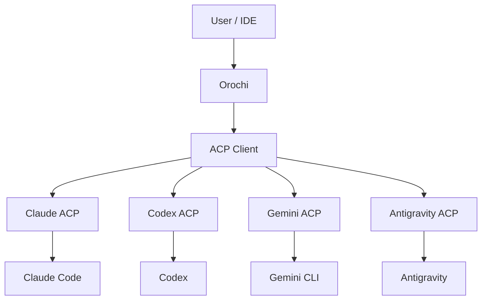
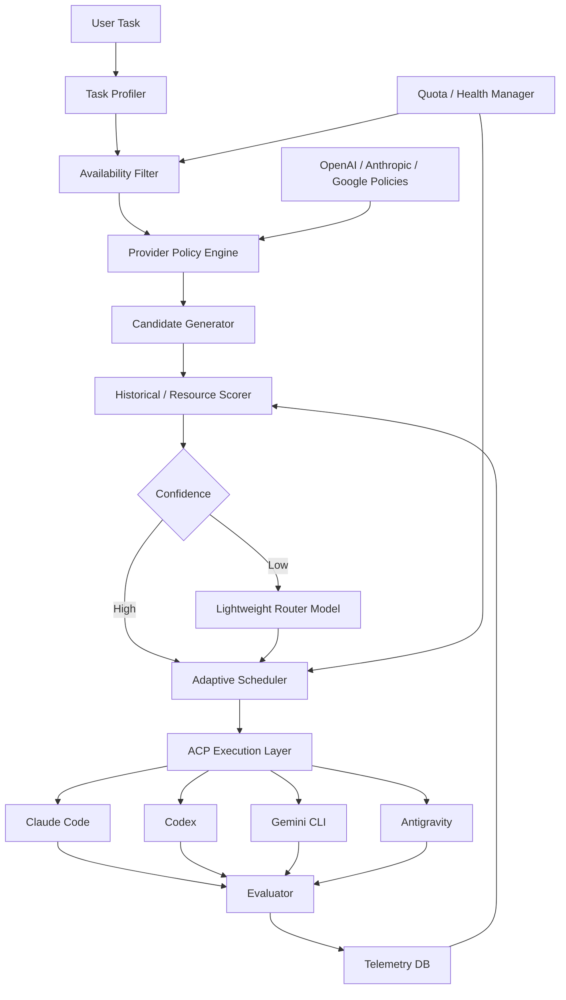
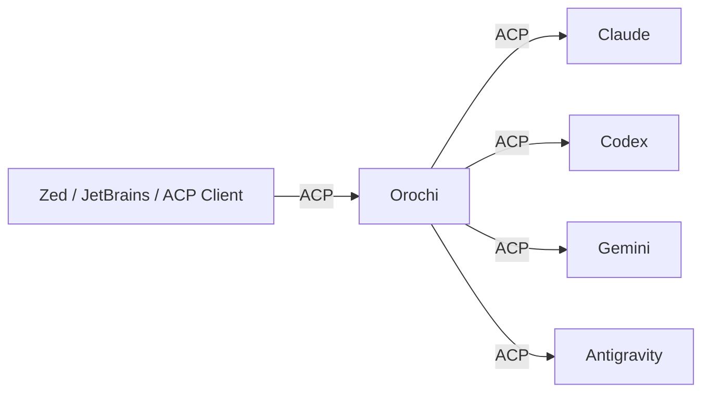

# Orochi — Adaptive Agent & Model Scheduler

**Status:** Draft  
**Project Name:** Orochi  
**Target:** Local CLI / OSS  
**Language:** Rust  
**Protocol:** Agent Client Protocol (ACP)  
**Primary use case:** Automatically select among multiple AI coding agents and models based on availability, performance, token efficiency and official provider recommendations

---

## 1. Overview

**Orochi** is a local execution platform that lets a single CLI use multiple coding agents such as Claude Code, Codex, Gemini CLI and Antigravity, and automatically selects, for each task, the optimal

**Agent × Model × Reasoning Level × Session Strategy**

for that task.

As a rule, the user does not specify an agent or a model.

```bash id="txqo5n"
orochi "Switch the authentication logic to a refresh-token scheme"
```

is all they run.

Internally, Orochi takes into account current usage limits, task difficulty, model characteristics, official provider best practices, past execution results and context/cache state, and selects the most efficient execution configuration.

The goal of this project is not simply "picking the cheapest model".

> **Minimize the expected total resource consumption required to reach success.**

This is the optimization target.

---

# 2. Goals

| Goal | Description |
|---|---|
| Automatic agent selection | Choose from Claude / Codex / Gemini / Antigravity, etc. |
| Automatic model selection | Choose Sonnet / Fable / Astra / Flash, etc. according to the task |
| Automatic reasoning selection | Set low / medium / high, etc. automatically |
| Quota-aware | Automatically exclude agents that are under a usage limit |
| Token-aware | Account for token consumption, cache and retries |
| Provider-aware | Follow official OpenAI / Anthropic / Google recommendations |
| Adaptive | Gradually optimize from actual success rates and consumption |
| ACP-native | Keep agent-specific implementation to a minimum |
| Local-first | Run on the user's PC as a rule |
| Zero-decision UX | Do not ask the user to choose a model in normal use |

---

# 3. Non-Goals

The MVP does not implement a coding agent of its own.

Rather than replacing existing agents such as Claude Code and Codex, Orochi sits in the chain

```text id="ooiuhx"
User
 ↓
Orochi
 ↓
Existing Coding Agents
```

and operates as a control plane.

In addition, the MVP does not make a multi-agent council / majority vote the default behavior. Running multiple agents significantly worsens token efficiency, so it is not used as long as a single agent's likelihood of success is high enough.

---

# 4. Technical Decision

## 4.1 Rust

The Orochi core is implemented in Rust.

This system is less an LLM application and much more a

**Process Supervisor + Scheduler + Protocol Gateway**

in nature.

It has to safely handle multiple long-running subprocesses, stdio, JSON-RPC, timers, SQLite, signal handling and parallel sessions, which makes it a good fit for Rust.

ACP has an official Rust SDK, which provides Client / Agent / Proxy / Conductor. ([github.com](https://github.com/agentclientprotocol/rust-sdk?utm_source=chatgpt.com))

The main technologies are expected to be the following.

| Purpose | Technology |
|---|---|
| Runtime | Tokio |
| CLI | clap |
| Serialization | serde |
| ACP | agent-client-protocol |
| Database | SQLite |
| DB access | sqlx / rusqlite |
| Logging | tracing |
| Error | thiserror |

---

# 5. ACP Strategy

ACP is used as an **Agent Execution Abstraction**.

ACP itself carries no routing logic.



ACP v1 is currently stable. Session Config Options have also been stabilized, and agents can expose session-level configuration such as `model`, `mode` and `thought_level`. Model names and reasoning levels therefore do not need to be fully hard-coded on Orochi's side. ([agentclientprotocol.com](https://agentclientprotocol.com/announcements/session-config-options-stabilized?utm_source=chatgpt.com))

Antigravity also has an integration usable from the ACP ecosystem, so it is in scope for integration into the same control plane. ([zed.dev](https://zed.dev/acp/agent/antigravity-acp?utm_source=chatgpt.com))

---

# 6. What ACP Does Not Solve

ACP alone does not complete Orochi.

In particular, the current stable ACP specification does not sufficiently standardize the following.

| Capability | ACP |
|---|---|
| Model discovery | Stable |
| Reasoning configuration | Stable |
| Session management | Stable |
| Agent execution | Stable |
| Token usage | Draft |
| Context consumption | Draft |
| API cost | Draft |
| Subscription quota | Non-standard |
| Rate-limit reset | Non-standard |
| Weekly / 5h usage limit | Non-standard |

ACP's Session Usage proposal moves toward standardizing token usage, cached tokens, thought tokens, context usage and so on, but it is still a Draft at this point. ([agentclientprotocol.com](https://agentclientprotocol.com/rfds/session-usage?utm_source=chatgpt.com))

The following structure is therefore adopted.

```text id="oww8v5"
Agent Integration

ACP Standard Layer
        +
Provider Adapter
        +
Runtime Observation
```

---

# 7. High-Level Architecture



---

# 8. Execution Unit

Orochi does not select the agent and the model separately; ultimately it treats the following as a single candidate.

```text id="q8okk8"
ExecutionCandidate

agent
model
reasoning_level
mode
session_strategy
context_strategy
```

For example,

```text id="6e0gm1"
Codex + GPT-5.6 Sol + medium
Codex + GPT-6 Astra + high

Claude + Sonnet + medium
Claude + Fable + high

Gemini + Flash + low
Gemini + Pro + high
```

are separate candidates.

This way, instead of asking

> "Claude or Codex?"

Orochi asks

> "Which execution configuration has the lowest expected cost of getting this task to succeed?"

and can optimize that directly.

---

# 9. Control Plane

## 9.1 Task Profiler

The full task text and the repository are not handed to an LLM up front.

As far as possible, the Task Descriptor is generated from local information.

```text id="fcc344"
TaskDescriptor

task_type
language
framework
repo_size
candidate_files
estimated_scope
estimated_context
requires_architecture_change
requires_browser
requires_web
tests_available
ambiguity
long_horizon
```

Example task types:

```text id="r4tuv1"
bug_fix
small_edit
implementation
refactor
architecture
migration
test
review
documentation
investigation
```

These are inferred automatically from the repository's git diff, file tree, manifests, test environment and so on.

---

# 10. Three-Level Routing

Minimize the token consumption of routing itself.

## Level 0 — Deterministic Router

Uses no LLM.

```text id="3hllib"
Task
 ↓
Capability
Quota
Provider Policy
Historical Statistics
 ↓
confidence >= threshold
 ↓
Execute
```

When confidence is sufficient, the task is executed immediately.

---

## Level 1 — Lightweight Router Model

A small model is used only when the decision is ambiguous.

The router model pool consists of, for example,

```text id="srho6f"
Gemini Flash
GPT Luna
Claude Haiku
```

and similar low-cost / fast models.

Input to the router is limited to the Task Descriptor and the candidate list.

The full repository is not passed.

The router only recommends options; it **does not have the final say**.

---

## Level 2 — Frontier Judge

Used only for extremely difficult decisions.

Examples:

```text id="ghqwzw"
Large-scale architecture migration
Unfamiliar repository
Very high ambiguity
Several frontier models with closely matched expected performance
```

Only in these cases are Astra / Fable, etc. consulted for planning / routing decisions.

It is not used normally.

---

# 11. Provider Policy Engine

Rather than Orochi's own intuition, each provider's official recommendations are treated as first-class policy.

The order of precedence is as follows.

1. Provider hard constraints
2. Provider official recommendations
3. ACP runtime capabilities
4. Current quota / health
5. Historical local performance
6. Router recommendation

### OpenAI

OpenAI recommends explicitly tuning reasoning effort per model, and its latest model guidance also states a policy of raising effort only when evals confirm an improvement, rather than always using high effort. ([developers.openai.com](https://developers.openai.com/api/docs/guides/latest-model?utm_source=chatgpt.com))

The OpenAI policy therefore uses

```text id="x56470"
simple
→ low

normal agentic coding
→ medium

complex
→ high

extremely difficult / long-horizon
→ xhigh, etc.
```

as its initial prior.

Frontier models such as Astra are not treated as "expensive, so last" either.

This is because, when using a high-performance model from the start reduces retries, doing so results in lower expected token consumption.

---

### Anthropic

Adaptive thinking is recommended for the latest Claude generation.

Anthropic recommends adaptive thinking, in which Claude itself dynamically adjusts the amount of thinking based on query complexity and `effort`, and describes it as suited to complex coding and long-horizon agent loops. ([docs.anthropic.com](https://docs.anthropic.com/en/docs/build-with-claude/prompt-engineering/prompt-templates-and-variables?utm_source=chatgpt.com))

Rather than Orochi specifying a fixed thinking budget in detail, the Anthropic policy is therefore based on

```text id="b1wf1h"
model selection
+
effort selection
+
adaptive thinking
```

as its baseline.

---

### Google

By default, Gemini performs dynamic thinking according to task complexity, and this can be controlled with `thinking_level`. ([ai.google.dev](https://ai.google.dev/gemini-api/docs/thinking?hl=ja&utm_source=chatgpt.com))

Therefore,

```text id="ntunv6"
simple → minimal / low
normal → medium
complex → high
```

is used as the initial prior.

---

# 12. Policy Distribution

Provider policies are not fully hard-coded into the Rust binary.

```text id="xkugvn"
policies/

openai.json
anthropic.json
google.json
```

They are kept under version control as the files above.

A policy contains at least the following.

| Field | Description |
|---|---|
| provider | Provider |
| version | Policy version |
| source | Official documentation |
| updated_at | Last updated |
| models | Model information |
| task_profiles | Recommended uses |
| reasoning_rules | Reasoning settings |
| context_rules | Context strategy |
| cache_rules | Cache strategy |
| hard_constraints | Prohibited settings |
| fallback_rules | Fallback policy |

Policies can be updated from the CLI.

```bash id="wdbi46"
orochi policy update
```

The structure should be able to keep up with updates to provider documentation.

---

# 13. Quota Manager

Runtime state is kept per agent and per model.

```text id="emz2jr"
AVAILABLE
  ↓
SOFT_LIMIT
  ↓
COOLDOWN
  ↓
PROBE
  ↓
AVAILABLE
```

Internal state:

```text id="7wmnrl"
AgentRuntimeState

agent
model
status

quota_estimate
cooldown_until

last_success_at
last_failure_at

consecutive_failures
rate_limit_count
```

If the reset time can be obtained from the rate-limit response, then

```text id="c9hr9w"
cooldown_until = reset_at
```

is set.

If it cannot be obtained, exponential backoff is used.

```text id="2o8lus"
5m
15m
30m
60m
```

An agent in COOLDOWN is completely excluded from the Candidate Generator.

---

# 14. Quota Shadow Price

With subscriptions, API prices alone are not enough to optimize against.

The remaining usage allowance itself is treated as a virtual cost.

```text id="nr0j0j"
effective_resource_cost
=
expected_tokens
× quota_shadow_price
```

For example, if

```text id="b6fev8"
Claude
estimated remaining = 8%
reset = 4h

Codex
estimated remaining = 75%
reset = 1h
```

then Codex is preferred for tasks where the performance difference is small.

On the other hand, for a task whose success rate drops sharply without Claude / Fable, Claude can still be selected.

---

# 15. Optimization Objective

The optimization target is not the per-token price.

```text id="alpro0"
Expected Resource Cost To Successful Completion
```

is the target.

Conceptually,

```text id="ktlca4"
expected_cost =

expected_input_tokens
+ expected_output_tokens
+ expected_reasoning_tokens
+ retry_cost
+ cache_miss_cost
+ context_rehydration_cost
+ quota_shadow_cost
+ latency_penalty
```

is minimized.

Constraint:

```text id="wy8zb8"
P(success) >= required_confidence
```

This avoids wasting tokens on sequences like

```text id="6lsete"
cheap model
→ failure
→ medium
→ failure
→ frontier
```

and instead uses Fable / Astra, etc. from the start on tasks that need them.

---

# 16. Cache-Aware Scheduling

Each provider's prompt / context cache is used.

In Google Gemini, implicit context caching is enabled by default, and placing large shared content toward the prefix raises the cache hit probability. ([ai.google.dev](https://ai.google.dev/gemini-api/docs/caching?authuser=01&hl=en&utm_source=chatgpt.com))

OpenAI also provides a prompt cache key and cache breakpoints. ([developers.openai.com](https://developers.openai.com/api/reference/cli/resources/responses/methods/create?utm_source=chatgpt.com))

The scheduler therefore gives tasks with

```text id="4waio4"
same repository
same instructions
same tool set
same model
```

a cache-affinity bonus in their score.

It does not switch provider / model more than necessary.

---

# 17. Context Management

The full conversation history is not passed between agents.

Orochi keeps its own independent `TaskEnvelope`.

```text id="n3f6g5"
TaskEnvelope

original_task
constraints

current_status

changed_files
git_diff_summary

tests
failed_tests

completed_items
remaining_items
```

For the repository itself, the filesystem is the single source of truth.

For example, when Codex reaches its usage limit,

```text id="ynikhy"
Codex
 ↓
COOLDOWN
 ↓
Generate TaskEnvelope
 ↓
Hand off to Claude
 ↓
Claude rebuilds its understanding from filesystem / git
```

is what happens.

This keeps token consumption down when the agent changes.

---

# 18. Evaluator

Orochi's learning requires evaluating execution results.

An LLM judge is not used from the outset.

Order of precedence:

```text id="7y14sl"
tests
typecheck
lint
build
runtime checks
git diff validation
```

An LLM judge is used only when these cannot evaluate the result.

Each result is classified as one of the following.

```text id="hf11qp"
success
partial_success
failure
```

---

# 19. Telemetry

Each run is recorded in SQLite.

Main fields:

| Category | Fields |
|---|---|
| Task | type, language, framework, scope |
| Environment | repository, files, context size |
| Execution | agent, model, reasoning |
| Usage | input/output/reasoning/cache tokens |
| Runtime | duration, retries |
| Quality | tests/build/lint |
| Outcome | success/partial/failure |
| User signal | retry/revert/follow-up |

Personal information and the source code itself are not stored in the telemetry DB.

---

# 20. Adaptive Learning

In the initial stage, provider policies and heuristics are used.

```text id="xgu7r3"
Phase 1
Official Policy + Rules

↓

Phase 2
Official Policy + EWMA statistics

↓

Phase 3
Contextual Bandit
```

Eventually, Contextual Thompson Sampling or similar will be considered.

Context:

```text id="jjnior"
task_type
language
framework
scope
context_size
ambiguity
tests_available
quota_state
cache_affinity
```

Arm:

```text id="aqzd0y"
Agent + Model + Reasoning
```

Reward:

```text id="vv61pb"
successful completion
────────────────────────
effective resource usage
```

These are the definitions used.

However, provider hard constraints are never overridden by learning.

---

# 21. Official Policy vs Learning

When policy and measured values conflict, the following hierarchy is maintained.

```text id="gckmb2"
Provider Hard Constraint
        ↓
Official Recommendation
        ↓
Empirical Optimization
```

Initially, the official policy is used as a strong prior, and the weight of local telemetry increases as observed data accumulates.

However, if, for example, a provider explicitly states that a particular parameter is not to be used, that parameter is not explored.

---

# 22. Agent Adapter

Provider-specific processing is kept out of the Orochi core.

```text id="mtsm5w"
AgentAdapter

discover_capabilities()
discover_models()
set_model()
set_reasoning()

get_usage()
get_quota()

classify_error()

spawn()
stop()

create_session()
resume_session()
```

Common parts are delegated to ACP.

```text id="865xnj"
ACP
 ├─ session
 ├─ prompt
 ├─ model
 ├─ thought_level
 └─ streaming
```

Adapters implement only what is missing.

```text id="f3mc8x"
ClaudeAdapter
CodexAdapter
GeminiAdapter
AntigravityAdapter
```

If ACP's Session Usage becomes stable in the future, it should be possible to remove the provider-specific code step by step. ([agentclientprotocol.com](https://agentclientprotocol.com/rfds/session-usage?utm_source=chatgpt.com))

---

# 23. Orochi as an ACP Agent

In the future, Orochi itself will also be exposed as an ACP agent.



From an external client's point of view,

```text id="ouekqj"
Orochi
```

is the only agent that exists.

The internal agent / model selection is completely hidden.

The official Rust ACP SDK provides not only Client / Agent but also Proxy / Conductor, which makes this kind of composition easy to implement. ([github.com](https://github.com/agentclientprotocol/rust-sdk?utm_source=chatgpt.com))

This makes Orochi usable not only as a CLI but also as an

**ACP-compatible Smart Agent Gateway**

in its own right.

---

# 24. CLI UX

Normal use:

```bash id="4t0vuc"
orochi "Implement this issue"
```

Checking status:

```bash id="8d57mp"
orochi status
```

Expected output:

```text id="pytzie"
AGENT          MODEL             STATUS       QUOTA
Codex          GPT-5.6 Sol       available    healthy
Claude         Sonnet            cooldown     41m
Antigravity    Gemini Flash      available    healthy
Gemini CLI     Gemini Flash      available    healthy

Current route:
Codex / GPT-5.6 Sol / medium

Reason:
- medium complexity implementation
- strong historical success rate
- healthy quota
- reusable context/cache
```

Explicit selection is also kept as an escape hatch.

```bash id="ud0syq"
orochi --agent claude "..."
orochi --model fable "..."
orochi --reasoning high "..."
```

In normal use, however, it should not be needed.

Policy operations:

```bash id="z19q1d"
orochi policy status
orochi policy update
```

Checking agents:

```bash id="ji628k"
orochi agents
```

Checking sessions:

```bash id="diq3yk"
orochi sessions
```

---

# 25. Suggested Project Structure

```text id="mkeb6h"
orochi/

src/

main.rs

cli/
    run
    status
    agents
    sessions
    config
    policy

acp/
    client
    server
    session
    registry

agents/
    adapter
    claude
    codex
    gemini
    antigravity

router/
    profiler
    candidate
    scorer
    classifier
    policy

scheduler/
    scheduler
    quota
    health
    retry
    circuit_breaker

context/
    envelope
    cache
    handoff

evaluator/
    tests
    build
    judge

telemetry/
    usage
    outcome
    learning

policy/
    registry
    openai
    anthropic
    google

storage/
    sqlite
```

---

# 26. MVP

The MVP implements everything up to the following.

| Feature | MVP |
|---|---|
| Rust CLI | Yes |
| `orochi` command | Yes |
| ACP Client | Yes |
| Claude integration | Yes |
| Codex integration | Yes |
| Gemini integration | Yes |
| Antigravity integration | Yes |
| Model discovery | Yes |
| Reasoning discovery | Yes |
| Deterministic routing | Yes |
| Lightweight Router Model | Yes |
| Quota cooldown | Yes |
| Retry / fallback | Yes |
| TaskEnvelope handoff | Yes |
| SQLite telemetry | Yes |
| Provider Policy | Yes |
| EWMA optimization | Later |
| Contextual Bandit | Later |
| Orochi as ACP Agent | Later |
| Parallel multi-agent council | Later |

---

# 27. Core Design Principles

1. **ACP is transport, not intelligence.**  
   ACP handles only the common I/O with agents.

2. **Provider recommendations are first-class.**  
   Official OpenAI / Anthropic / Google best practices form the initial policy.

3. **Frontier models are not last-resort models.**  
   If using Fable / Astra, etc. takes fewer total tokens to reach success, use them from the start.

4. **Routing must be cheaper than execution.**  
   Minimize use of the router model.

5. **Quota is a resource.**  
   Subscription allowances are also treated as having economic value.

6. **Filesystem is the source of truth.**  
   Do not copy conversation history in handoffs between agents.

7. **Measure outcomes.**  
   Learn success rates on real repositories, not just from benchmarks.

8. **Optimize cost-to-success, not cost-per-token.**

9. **Orochi should disappear from the user's decision making.**  
   The success criterion is that the user no longer has to think about agent / model / reasoning.

---

# 28. Success Metrics

Primary KPI:

```text id="j2d45w"
Effective Tokens per Successful Task
```

Secondary metrics:

| Metric | Goal |
|---|---|
| First-attempt success rate | ↑ |
| Tokens / successful task | ↓ |
| Retry rate | ↓ |
| Router overhead | ↓ |
| Cache hit rate | ↑ |
| Quota-related failures | ≈ 0 |
| User manual model selection | ≈ 0 |
| Handoff overhead | ↓ |

For the router's own token consumption, the **target is less than 1%** of total token consumption.

---

# 29. Key Open Questions

| Question | Direction |
|---|---|
| How to obtain subscription quota | Per-provider adapter + runtime observation |
| Success determination | Centered on test/build; judge only when needed |
| Router model | Flash / Luna / Haiku class |
| Router failure | deterministic fallback |
| Policy updates | Consider a remote signed policy registry |
| Model alias changes | Prefer ACP discovery |
| Agent authentication | Use each agent's own official login |
| Multi-agent execution | Future support, only for high ambiguity |
| Telemetry sharing | Local only by default |

---

# 30. Product Definition

Orochi is not to be implemented as a mere "wrapper around multiple AI CLIs".

At its core, Orochi is an

> **Adaptive Agent & Model Scheduler for Coding Agents**

Responsibilities are clearly separated among the components.

```text id="slez47"
ACP
= How to execute

Provider Policy
= How each provider recommends execution

Router
= Which execution candidate is appropriate

Quota Manager
= What resources are currently available

Scheduler
= Final execution decision

Context Manager
= How to preserve useful state efficiently

Evaluator
= Did it work?

Telemetry
= What actually worked best?
```

---

# 31. Target User Experience

In terms of user experience, the eventual aim is a state where

```bash id="07zj70"
orochi "Do it"
```

is all that is needed.

Internally, Orochi carries out

```text id="cvo1xr"
Task analysis
     ↓
Available agent detection
     ↓
Quota / health filtering
     ↓
Provider policy evaluation
     ↓
Agent selection
     ↓
Model selection
     ↓
Reasoning selection
     ↓
Context / cache strategy
     ↓
Execution
     ↓
Evaluation
     ↓
Learning
```

automatically.

In other words:

> **Treat the available AI subscriptions, agents and models as a single pool of compute resources, and have Orochi decide the most efficient way to execute at any given moment.**

This is the ultimate product vision.

---

# 32. Naming

Official project name:

**Orochi**

Descriptive name:

**Orochi — Adaptive Agent & Model Scheduler**

CLI binary:

```text id="oozjob"
orochi
```

The name Orochi is used to symbolize a structure in which many agents / models are handled from a single control plane.

---

# 33. References

ACP currently has a stable protocol v1 and provides an official Rust SDK and Session Config Options. ([github.com](https://github.com/agentclientprotocol/rust-sdk?utm_source=chatgpt.com))

For ACP Session Usage, a proposal to standardize token / context / cost reporting exists, but it is currently a Draft. ([agentclientprotocol.com](https://agentclientprotocol.com/rfds/session-usage?utm_source=chatgpt.com))

OpenAI recommends adjusting reasoning effort according to the task / evals and not using high reasoning unconditionally. ([developers.openai.com](https://developers.openai.com/api/docs/guides/latest-model?utm_source=chatgpt.com))

Anthropic recommends adaptive thinking for the latest Claude generation and advises using it for complex coding and long-horizon agentic workloads. ([docs.anthropic.com](https://docs.anthropic.com/en/docs/build-with-claude/prompt-engineering/prompt-templates-and-variables?utm_source=chatgpt.com))

Gemini provides dynamic thinking and `thinking_level`, and from 2.5 onward also provides implicit context caching. ([ai.google.dev](https://ai.google.dev/gemini-api/docs/caching?authuser=01&hl=en&utm_source=chatgpt.com))
