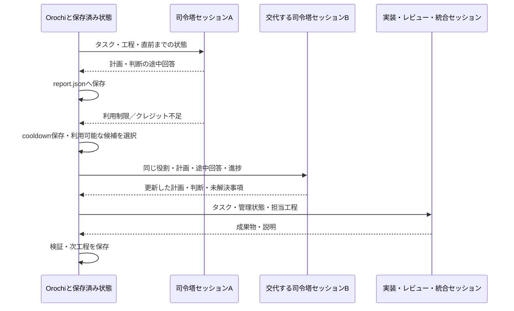

# 独立セッションによる協議と担当交代

作業者の単位は**独立したACPセッション**です。同じCLI・モデルでも、セッションが異なれば別の作業者として扱います。司令塔・実装・レビュー・統合の全役割に同じ交代処理を適用します。

Orochiがタスク・工程・計画・判断・未解決事項・回答・メッセージ・検証結果を保持します。あるAIの会話だけに進行状態を依存させません。

実装者は最大4人まで同時に作業でき、Orochiが結果をマージします。参加者は任意の相手へ宛先付きのメッセージを送れます。協議ラウンドでは、未回答のメッセージがある参加者が返信します。`--apply`を指定すると、検証に成功した結果を元の作業ツリーへマージします。競合は解消用のセッションで解決します。



## 実行と再開

```sh
orochi --permission allow -C /path/to/project collaborate \
  '入力検証を実装して' \
  --plan /absolute/path/to/session-plan.json \
  --output /path/to/results/run-001 \
  --apply          # 省略時は元の作業ツリーを変更しない

# 全候補の利用制限、試行上限、明示キャンセル後に同じ工程から再開
orochi --permission allow -C /path/to/project collaborate-resume \
  --output /path/to/results/run-001

# 完了済みの協議の結果を、後から作業ツリーへ適用する
orochi -C /path/to/project collaborate-resume --output /path/to/results/run-001 --apply
```

終了コードは、完了（`--apply`指定時は適用まで完了）で`0`、キャンセルで`130`、それ以外は`1`です。

設定例は [`examples/session-plan.json`](../examples/session-plan.json)と、並列実装・協議ラウンドを使う[`examples/session-plan-parallel.json`](../examples/session-plan-parallel.json)。司令塔を先頭に置き、その後に実装者1〜4人・レビュー者1〜4人・統合者1人を指定します。司令塔は省略可能です。

司令塔は最初と各工程の終了後に呼ばれ、`plan`・`decisions`・`open_questions`・`next_step`をJSONで更新します。その都度独立したセッションを用い、前回までの管理状態と成果物・検証結果を渡します。工程の順番と最終的な評価はOrochiが管理します。AIの提案だけでレビュー工程を省略したり、未検証の成果を成功扱いしたりしません。

## 工程

```text
[司令塔] → 実装者（全員を同時に実行） → [司令塔] → [マージ] → レビュー者1 → [司令塔] → …
→ 協議ラウンド1〜N → [再マージ] → 統合者 → [司令塔] → [作業ツリーへの適用]
```

`[マージ]`は実装者が2人以上の場合、協議ラウンドは`discussion`を指定した場合、適用は`--apply`の場合だけ入ります。従来の計画（実装者1人・協議なし）の工程番号は変わりません。

### 並列実装とマージ

```json
{"id": "alice", "role": "implementer", "agent": "claude", "model": "haiku", "paths": ["textstats/words.py"]}
```

- 実装者はそれぞれ開始状態のコピーで同時に作業します。`paths`は担当範囲の指示として伝えるだけで、編集の禁止はしません。
- 全員の完了後、開始状態を基準に1人ずつ3-wayマージします（`git merge-file`をリポジトリ外で実行）。重なる編集は競合マーカー付きで`merged/`に書き込みます。バイナリ、1 MiB超、削除と変更の衝突、symlinkはマーカーを付けず、競合として記録します。
- レビュー者・統合者は`merged/`のコピーで作業します。統合者の評価には、競合があったファイルにマーカーが残っていないかの確認（`git_conflict_markers`）を加えます。残っていれば評価失敗として、別の担当に交代します。
- 並列実装では各実装者の作業コピーだけで全体のチェックは通らないことがあるため、実装者の工程では評価を必須にしません。統合後に評価します。1人の場合は従来どおり実装者の工程でも評価します。
- 一部の実装者だけが失敗した場合、完了した実装者の結果は保持します。再開時は未完了の実装者だけを実行します。

### 宛先指定の通信と協議ラウンド

各参加者は回答の末尾に次のJSONを付けて、任意の参加者へメッセージを送れます。司令塔は管理状態JSONの`messages`欄を使います。

```json
{"messages": [{"to": "reviewer", "body": "入力検証を追加しました。確認してください。"}]}
```

```json
{"participants": [...], "discussion": {"max_rounds": 2}}
```

- 宛先は参加者ID（大文字小文字を区別しない）。存在しない宛先、自分宛て、空または8 KiB超の本文は`rejected`として記録し、届けません。1回の回答で8件まで、受理は全体で32件、記録は64件までです。
- 協議ラウンドでは、未回答のメッセージがある司令塔・実装者・レビュー者が同時に返信します。実装者は自分の作業コピーを更新でき、レビュー者は編集しません。新しいメッセージがなければ残りのラウンドは飛ばします。協議後、実装者が2人以上なら再マージします。
- 統合者は全メッセージを統合時に読みます。司令塔も全メッセージを参照します。他の参加者には自分が送受信したものだけを渡します。
- メッセージは作業上のメモとして扱い、元の依頼やリポジトリの指示を上書きする権限は持たせません。

### 元の作業ツリーへの適用

`--apply`は、統合結果の評価が**実際のチェックの合格**（`success`）の場合だけ動きます。チェックがない`partial_success`では適用せず、`application.status = "skipped"`として終了コード`1`を返します。

1. 同じリポジトリを使う他のOrochi実行と排他するロックを取ります。
2. 開始状態・現在の作業ツリー・統合結果で3-wayマージします。開始後にユーザーが編集した内容も保持します。
3. 競合がなければ、全ファイルを一時ファイルに書き出してから置き換えます。書き込み直前に各ファイルが計算時の状態のままか確認し、変わっていれば何も書きません。
4. 競合があれば、現在の作業ツリーを`resolve-base/`（固定用）と`resolve/`へコピーし、マーカー付きのマージ結果を置きます。統合者と同じ担当設定で解消用のセッションを実行し、チェックとマーカー確認に合格した結果だけを適用します。
5. 解消中に作業ツリーが変わった場合は上書きせず、`blocked`で停止します。再開すると最新の状態で再度マージし、新しい解消セッションを実行します。

`.git`・`.env*`・`node_modules`など、コピー対象外のパスは読み書きしません。適用したファイルは`application.files`に記録します。

## 候補選択と切り替え

```json
{
  "id": "manager",
  "role": "coordinator",
  "agent": "claude",
  "model": "haiku",
  "fallback": true,
  "allowed_agents": ["claude", "codex"]
}
```

- `agent`・`model`・`reasoning`・`mode`は最初に試す希望設定。`agent`を省略すると最初から自動選択。
- `fallback`は既定で`true`。利用不能・制限・クレジット不足・接続切断・タイムアウト・評価失敗時に、利用可能な別候補を試す。
- `allowed_agents`は交代先を含む候補の範囲。省略するとユーザー設定の有効なAgentが対象。範囲外へは送信しない。
- 固定したい場合は`fallback: false`。明示キャンセル・権限拒否でも交代せず停止する。
- モデル単位の制限はそのモデルを除外。アカウント単位の制限はAgent全体を除外し、後続工程でも同じcooldownを参照する。
- 交代先はPolicy、推定成功率の下限、機能、残量、期待コスト、設定済みの学習方式で選ぶ。異なるProviderのモデル名や推論設定を強制的に引き継がない。
- 1工程あたりの試行上限は`scheduler.max_attempts`（既定3）。範囲内の全候補が使えなければ`blocked`として保存。再開コマンドでは完了済み工程を飛ばし、未完了工程に新しい試行枠を与える。

残量を各工程の前に更新する場合は`[quota] refresh_before_run = true`を設定します。既定では保存済みの有効な観測と実行時エラーを使います。未知の残量はゼロとみなしません。全サービスが利用不能な間はAIによる処理は進みませんが、保存状態から後で再開できます。

参加者IDは大小文字を区別せず一意で、`baseline`・`control`は予約名です。Agent・モデルは複数参加者で同一にできます。

## 保存と引き継ぎ

`report.json`（schema version 2）を、同じディレクトリ内の一時ファイルからアトミックに置換します。途中の回答は受信ごとに保存し、完了した工程だけ`next_stage`を進めます。1回の回答は64 KiB、全体で256試行までです。

- `task`・`plan`: 元の依頼と担当・工程の設定。
- `management`: 司令塔の計画・判断・未解決事項・次の提案。
- `messages`: 宛先付きメッセージ（送信工程・送信者・宛先・本文・拒否理由）。
- `merges`: 並列実装のマージ結果と競合。
- `apply_requested`・`application`: 作業ツリーへの適用の要否、状態（`pending / resolving / resolved / applied / skipped`）、適用ファイル、競合、解消回数。
- `next_stage`・`status`: 再開位置と`running / blocked / cancelled / completed`。
- `sessions`: 成功・失敗・途中中断を含む全実行。各回に別の`worker_id`・`session_id`を記録。`turn`は`scheduled / discussion / resolution`。
- `response`・`checks`・`error_kind`・`usage`: 途中回答、検証結果、交代理由、実usage。
- `final_workspace`: 統合した成果物の場所。

別の担当への交代時は、**同じ担当の作業ディレクトリを使って編集途中のファイルを維持**し、前任者の途中回答・エラー・検証結果を渡します。交代前には旧ACPプロセスを終了します。Agentからの回答は作業上の情報として渡し、元の依頼やリポジトリ指示を上書きする権限は持たせません。

再開時は同じ`--cwd`を指定します。設定・認証・利用可否は現在のものを使い、保存した計画の候補範囲を守ります。出力ディレクトリの排他ロックで二重再開を防ぎます。schema version 1の過去レポートは再開対象外です。新しい項目を持たないschema version 2のレポートも再開できます。

### 強制終了からの復旧

ACP Agentは`orochi`自身の監視プロセス経由で起動します。監視プロセスはAgentのプロセスグループを率い、Agentと観測した子孫プロセス（プロセスグループを離れたものも含む）をデータディレクトリの`processes/`に記録します。各プロセスはPIDと開始時刻の組で識別し、再利用されたPIDには信号を送りません。

- Orochiが`SIGKILL`等で終了すると、監視プロセスが親の消失を検知し、記録したプロセスへSIGTERM、2秒後にSIGKILLを送ります。
- 監視プロセスも同時に終了した場合は、次に起動したOrochiが、所有者が存在しない記録を回収します。所有者が動作中の記録には触れません。
- 通常の停止時も、プロセスグループの終了後に、記録されたグループ外の子孫を終了します。
- 実行中の工程は`running`のまま残るため、再開時に`interrupted`として扱い、途中回答と作業コピーを次のセッションへ渡します。
- 記録の取得はmacOSとLinuxに対応します。プロセスの記録より先に終了・再親子付けされた短命のプロセスは対象外です。

## 成果物の隔離

`--output`は新規ディレクトリを指定します。ソース外、またはソース内の`.orochi/`配下に置けます。

- `baseline/`: 開始状態のコピー。
- `control/<工程番号>/`: 司令塔ごとの独立した作業コピー。
- `<参加者ID>/`: 実装・レビュー・統合の作業コピー。
- `merged/`: 並列実装のマージ結果。
- `resolve-base/`・`resolve/`: 作業ツリーとの競合を解消する際の固定コピーと作業コピー。
- `report.json`: 再開に必要な状態と実行履歴。

元の作業ツリーは`--apply`指定時だけ変更します。司令塔・レビュー中の編集は統合元に使わず、実装者の成果物と申し送りを統合者へ渡します。`.git`・`.orochi`・`target`・`node_modules`・`.venv`・`.env*`・`__pycache__`を除外し、symlink・特殊ファイルを拒否します。コピーは100 MiB・20,000ファイルまでです。

レポートにはタスク本文と回答が含まれます。通常のSQLite telemetryとは保存範囲が異なります。役割ごとの成功・失敗を通常の実装品質の学習には混ぜませんが、利用制限は共有runtimeに記録します。Agent自体はOS sandboxではありません。

## 現時点の範囲

- 固定工程での計画更新・担当交代・状態引き継ぎ・再開、最大4人の並列実装とマージ、宛先指定の多往復通信、検証済み結果の作業ツリーへの適用と競合解消に対応。
- 実Claude／Codexで、並列実装・協議・統合・作業ツリーとの競合解消・適用を確認済み。強制終了からの回収と再開も実Claudeで確認済み（[実機検証](real-validation-20260916-2.md)）。
- 同じディレクトリを複数のセッションが同時に編集する方式ではなく、各自のコピーで作業してマージする方式。既存の外部セッションへの参加は未対応。
- 協議ラウンドはレビュー後の1箇所。統合者からの質問に実装者が答える往復は、統合後の司令塔への申し送りまで。
- `ask`で発生する権限要求は非対話のイベント収集中には拒否。明示的な`--permission allow`を使うと、一度限りの要求に自動応答する。
- Router／Judge／`--council`は別機能。ACPエージェントを判定役として、代替先付きで設定できる。詳細は[適応ルーティング](adaptive-routing.md)を参照。
