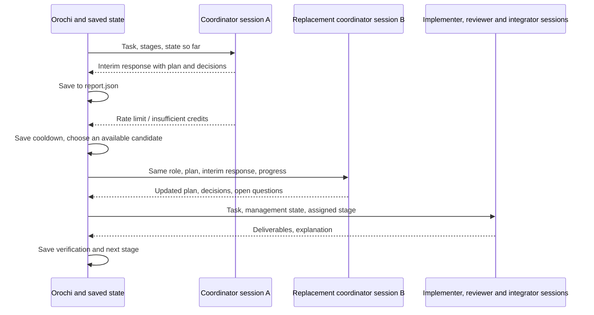

# Collaboration and Handoff Between Independent Sessions

The unit of a worker is an **independent ACP session**. Even with the same CLI and model, a different session is treated as a different worker. The same handoff process applies to every role: coordinator, implementer, reviewer and integrator.

Orochi holds the task, stages, plan, decisions, open questions, responses, messages and verification results. Progress never depends on any single AI's conversation alone.

Up to 4 implementers can work at the same time, and Orochi merges their results. When the work is divided into parts, Orochi runs the parts that can run side by side at the same time and the parts that build on others after them (see [The order of the work](#the-order-of-the-work-parts-and-waves)). Participants can send addressed messages to any other participant. In discussion rounds, participants with unanswered messages reply. With `--apply`, a result that passed verification is merged into the original working tree. Conflicts are resolved in a dedicated resolution session.



## Running and resuming

```sh
orochi --permission allow -C /path/to/project collaborate \
  'Implement input validation' \
  --plan /absolute/path/to/session-plan.json \
  --output /path/to/results/run-001 \
  --apply          # without it, the original working tree is not modified

# Resume from the same stage after every candidate hit a rate limit, the attempt limit was reached, or an explicit cancellation
orochi --permission allow -C /path/to/project collaborate-resume \
  --output /path/to/results/run-001

# Apply the result of a completed collaboration to the working tree afterwards
orochi -C /path/to/project collaborate-resume --output /path/to/results/run-001 --apply
```

The exit code is `0` on completion (with `--apply`, completion includes applying), `130` on cancellation, and `1` otherwise.

Example configurations are [`examples/session-plan.json`](../examples/session-plan.json), [`examples/session-plan-parallel.json`](../examples/session-plan-parallel.json), which uses parallel implementation and discussion rounds, and [`examples/session-plan-parts.json`](../examples/session-plan-parts.json), which divides the work into ordered parts. Put the coordinator first, followed by 1–4 implementers, 1–4 reviewers and 1 integrator. The coordinator is optional.

The coordinator is called at the start and after each stage, and updates `plan`, `decisions`, `open_questions` and `next_step` as JSON. Each call uses an independent session and receives the management state so far together with the deliverables and verification results. Orochi manages the order of stages and the final evaluation. An AI's suggestion alone never skips a review stage or treats an unverified result as a success.

## Stages

```text
[coordinator] → implementers (all run concurrently) → [coordinator] → [merge] → reviewer 1 → [coordinator] → …
→ discussion rounds 1–N → [re-merge] → integrator → [coordinator] → [apply to working tree]
```

`[merge]` appears only with 2 or more implementers, discussion rounds only when `discussion` is set, and applying only with `--apply`. Stage numbering for existing plans (one implementer, no discussion) does not change.

A plan with `parts` replaces the implementer step with one step per wave:

```text
[coordinator] → wave 1 → [merge of wave 1] → [coordinator] → wave 2 → … → reviewers → … → integrator → [coordinator] → [apply]
```

`[merge of wave N]` appears only when the wave ran more than one part. A plan without `parts` never produces these steps, so its numbering does not move.

### Parallel implementation and merging

```json
{"id": "alice", "role": "implementer", "agent": "claude", "model": "haiku", "paths": ["textstats/words.py"]}
```

- Each implementer works concurrently in its own copy of the starting state. `paths` is only passed on as guidance about the assigned scope; it does not forbid edits.
- After everyone finishes, the results are three-way merged one at a time against the starting state (`git merge-file` run outside any repository). Overlapping edits are written to `merged/` with conflict markers. Binaries, files over 1 MiB, delete/modify conflicts and symlinks get no markers and are recorded as conflicts.
- Reviewers and the integrator work in copies of `merged/`. The integrator's evaluation adds a check that no markers remain in files that had conflicts (`git_conflict_markers`). If any remain, the evaluation fails and the work is handed off to another worker.
- In parallel implementation, each implementer's working copy alone may not pass the checks for the whole project, so evaluation is not required at the implementer stage. Evaluation happens after integration. With a single implementer, the implementer stage is evaluated as before.
- If only some implementers fail, the results of those that completed are kept. On resume, only the implementers that did not complete are run.

### The order of the work: parts and waves

```json
"parts": [
  {"id": "words",  "brief": "Count words per line", "paths": ["textstats/words.py"]},
  {"id": "lines",  "brief": "Count blank and non-blank lines", "paths": ["textstats/lines.py"]},
  {"id": "report", "brief": "Print both counts", "paths": ["textstats/report.py"], "after": ["words", "lines"]}
]
```

A part is a piece of the work: `brief` says what it builds, `paths` which relative paths it writes, `after` which parts' code it needs first. With `parts`, the implementers are **seats**: each part runs on a seat (its `agent`, `allowed_agents`, `fallback` and so on), as many parts at once as there are implementer seats, and each part is its own session named after the part.

Orochi reads the order itself; the list is a proposal, not an instruction:

- A list that cannot be ordered — a cycle, an unknown or self-referencing `after`, a duplicate or invalid ID (lowercase letters, digits and `-`, at most 32 characters), more than 12 parts, a brief over 2 KiB, or a non-relative path — is refused whole. From a plan file that is an error; from a coordinator it leaves the team as it was. A part may not share a participant's ID.
- **Serial unless shown independent.** Two parts with no stated order run one after the other anyway, in listed order, when they may write the same place: the same path, one path inside the other, or a part that names no `paths` (it may write anywhere, so it runs with nothing beside it).
- A straight chain (a part whose only successor has it as its only predecessor) is fused into one session: one agent holding the whole context does a sequence better than several handing notes along.
- A wave wider than the number of implementer seats is split into consecutive waves, in listed order.

`--dry-run --plan` checks the parts and prints the order, e.g. `Order: words ‖ lines → report`.

Every wave starts from what the waves before it left: the first from `baseline/`, a later one from the previous wave's merge (or its one part's workspace). The parts of one wave are merged onto that starting tree in listed order, like parallel implementers, and the merge records per part how many changed files fell outside its `paths` (`strays`) — the evidence for or against trusting declared paths enough to run parts side by side. A conflict in any wave but the last is resolved before the next wave starts: the integrator's seat gets a resolution session in the merged tree, which must leave no conflict markers; if markers remain after every candidate, the run stops as `blocked` and the next wave never starts. The last wave's conflicts go to the integrator, as with parallel implementers.

Parts are not evaluated: a part in the middle may leave the project failing, because the callers of what it changed can be the next wave. Only the integrated result is evaluated, and only a real check pass is applied. With parts, implementer seats take no discussion turns and cannot be messaged.

**The coordinator's first turn may divide the work.** When a plan has a coordinator, no `parts` and two or more implementer seats, the first coordinator turn is asked for an optional `"parts"` field. Orochi takes it once, when that turn completes, and only if it can order it and something runs side by side; otherwise, and for anything a later coordinator turn says, the team keeps its shape. The accepted parts are written into `report.plan`, so a resume runs the same waves.

### Addressed messages and discussion rounds

Each participant can send messages to any participant by appending the following JSON to the end of its response. The coordinator uses the `messages` field of its management state JSON.

```json
{"messages": [{"to": "reviewer", "body": "I added input validation. Please take a look."}]}
```

```json
{"participants": [...], "discussion": {"max_rounds": 2}}
```

- Addresses are participant IDs (case-insensitive). Messages to a nonexistent address or to oneself, and messages with an empty body or a body over 8 KiB, are recorded as `rejected` and not delivered. Up to 8 per response, 32 accepted in total, and 64 recorded.
- In a discussion round, the coordinator, implementers and reviewers that have unanswered messages reply concurrently. Implementers may update their own working copies; reviewers do not edit. If there are no new messages, the remaining rounds are skipped. After the discussion, the results are re-merged if there are 2 or more implementers.
- The integrator reads all messages at integration time. The coordinator also sees all messages. Other participants receive only the messages they sent or received.
- Messages are treated as working notes and carry no authority to override the original request or the repository's instructions.

### Applying to the original working tree

`--apply` runs only when the evaluation of the integrated result is a **real check pass** (`success`). A `partial_success` without checks is not applied; the run ends with `application.status = "skipped"` and exit code `1`.

1. Take a lock that excludes other Orochi runs using the same repository.
2. Three-way merge the starting state, the current working tree and the integrated result. Edits the user made after the start are kept too.
3. If there are no conflicts, write every file to a temporary file first, then replace. Right before writing, check that each file is still in the state it had when the merge was computed; if any changed, write nothing.
4. If there are conflicts, copy the current working tree to `resolve-base/` (the fixed copy) and `resolve/`, and place the merge result with markers there. Run a resolution session with the same assignment settings as the integrator, and apply only a result that passes the checks and the marker check.
5. If the working tree changes during resolution, do not overwrite it; stop with `blocked`. Resuming merges again against the latest state and runs a new resolution session.

Paths excluded from copying, such as `.git`, `.env*` and `node_modules`, are never read or written. Applied files are recorded in `application.files`.

## Candidate selection and switching

```json
{
  "id": "manager",
  "role": "coordinator",
  "agent": "claude",
  "model": "haiku",
  "fallback": true,
  "allowed_agents": ["claude", "codex"]
}
```

- `agent`, `model`, `reasoning` and `mode` are the preferred settings to try first. Omitting `agent` means automatic selection from the start.
- `fallback` defaults to `true`. On unavailability, a limit, insufficient credits, a dropped connection, a timeout or an evaluation failure, another available candidate is tried.
- `allowed_agents` is the range of candidates, including handoff targets. When omitted, the enabled Agents in the user's config are the targets. Nothing is sent outside that range.
- To pin the choice, use `fallback: false`. An explicit cancellation or a permission denial also stops the run without a handoff.
- A model-scoped limit excludes that model. An account-scoped limit excludes the whole Agent, and later stages refer to the same cooldown.
- The handoff target is chosen by Policy, the lower bound on estimated success rate, capabilities, quota, expected cost and the configured learning strategy. Model names and reasoning settings from a different Provider are never forcibly carried over.
- The attempt limit per stage is `scheduler.max_attempts` (default 3). If no candidate in range is usable, the run is saved as `blocked`. The resume command skips completed stages and gives unfinished stages a fresh attempt budget.

To refresh quota before each stage, set `[quota] refresh_before_run = true`. By default, saved valid observations and runtime errors are used. Unknown quota is not treated as zero. While every service is unavailable, no AI work proceeds, but the run can be resumed later from the saved state.

Participant IDs must be unique (case-insensitive), and `baseline`, `control`, `merged`, `parts`, `resolve` and `resolve-base` are reserved names. Several participants can use the same Agent and model.

## Saving and handoff

`report.json` (schema version 2) is replaced atomically from a temporary file in the same directory. Interim responses are saved as each one is received, and `next_stage` advances only for completed stages. A single response is limited to 64 KiB, and a run to 256 attempts in total.

- `task`, `plan`: the original request and the assignment and stage configuration.
- `management`: the coordinator's plan, decisions, open questions and next proposal.
- `messages`: addressed messages (sending stage, sender, recipient, body, rejection reason).
- `merges`: merge results and conflicts from parallel implementation; with parts, also the `wave` merged and each part's `strays`.
- `elapsed_ms`: wall-clock time spent running, summed over every process that worked on it.
- `apply_requested`, `application`: whether applying to the working tree was requested, its state (`pending / resolving / resolved / applied / skipped`), applied files, conflicts and the number of resolutions.
- `next_stage`, `status`: the resume position and `running / blocked / cancelled / completed`.
- `sessions`: every run, including successes, failures and interruptions. Each one records its own `worker_id` and `session_id`. `turn` is `scheduled / discussion / resolution`.
- `response`, `checks`, `error_kind`, `usage`: interim response, verification results, handoff reason, actual usage.
- `final_workspace`: the location of the integrated deliverables.

When handing off to another worker, **the same assignment's working directory is reused so partially edited files are kept**, and the predecessor's interim response, errors and verification results are passed on. The old ACP process is terminated before the handoff. Responses from an Agent are passed on as working information and carry no authority to override the original request or the repository's instructions.

When resuming, specify the same `--cwd`. The current config, authentication and availability are used, and the candidate range of the saved plan is respected. An exclusive lock on the output directory prevents resuming twice. Past reports with schema version 1 cannot be resumed. Schema version 2 reports without the newer fields can still be resumed.

### Recovering from a forced termination

ACP Agents are started through `orochi`'s own supervisor process. The supervisor leads the Agent's process group and records the Agent and the descendant processes it observes (including those that left the process group) under `processes/` in the data directory. Each process is identified by its PID and start time pair, and a reused PID is never signaled.

- When Orochi is terminated by `SIGKILL` or similar, the supervisor detects that its parent is gone and sends SIGTERM to the recorded processes, then SIGKILL 2 seconds later.
- If the supervisor is terminated at the same time, the next Orochi to start reclaims records whose owner no longer exists. Records whose owner is still running are left alone.
- On a normal stop as well, recorded descendants outside the process group are terminated after the process group exits.
- A stage that was running remains `running`, so on resume it is treated as `interrupted`, and its interim response and working copy are passed to the next session.
- Recording is supported on macOS and Linux. Short-lived processes that exit or are reparented before they are recorded are not covered.

## Isolation of outputs

`--output` takes a new directory. It can be outside the source tree, or under `.orochi/` inside it.

- `baseline/`: a copy of the starting state.
- `control/<stage number>/`: an independent working copy for each coordinator call.
- `<participant ID>/`: working copies for implementers, reviewers and the integrator.
- `merged/`: the merge result of parallel implementation.
- `parts/<wave>/<part ID>/`, `parts/<wave>/_merged/`: each part's working copy and the merge of a wave that ran more than one part.
- `resolve-base/`, `resolve/`: the fixed copy and the working copy used when resolving conflicts with the working tree.
- `report.json`: the state needed to resume, and the run history.

The original working tree is changed only when `--apply` is given. Edits made by the coordinator or during review are not used as integration input; the implementers' deliverables and handoff notes are passed to the integrator. `.git`, `.orochi`, `target`, `node_modules`, `.venv`, `.env*` and `__pycache__` are excluded, and symlinks and special files are rejected. Copies are limited to 100 MiB and 20,000 files.

The report contains the task text and responses. Its storage scope differs from the regular SQLite telemetry. Per-role successes and failures are not mixed into the regular learning of implementation quality, but rate limits are recorded in the shared runtime state. The Agent itself is not an OS sandbox.

## Current scope

- Supported: plan updates, handoffs, state carry-over and resuming over fixed stages; parallel implementation by up to 4 implementers with merging; ordered parts run in waves; multi-round addressed messaging; applying a verified result to the working tree, with conflict resolution.
- Parts and waves (from a plan file, from the coordinator's first turn, and from the console's design step) are covered by **automated tests only**, with mock agents. Whether real agents propose useful divisions and keep to their declared `paths` is **unverified**; `strays` exists to measure the latter.
- Parallel implementation, discussion, integration, conflict resolution against the working tree and applying were verified against the real Claude and Codex CLIs. Recovery and resuming after a forced termination were also verified against the real Claude CLI ([Live Validation of Remaining Tasks (2026-09-16, part 2)](real-validation-20260916-2.md)).
- Instead of several sessions editing the same directory at once, each works in its own copy and the copies are merged. Joining an existing external session is not supported.
- Discussion rounds happen in one place, after review. An exchange in which implementers answer the integrator's questions goes only as far as the handoff notes to the coordinator after integration.
- Permission requests raised under `ask` are denied while events are collected non-interactively. With an explicit `--permission allow`, one-time requests are answered automatically.
- Router/Judge/`--council` is a separate feature. ACP agents can be configured as advisers, with fallbacks. See [Adaptive Routing and the ACP Gateway](adaptive-routing.md) for details.
